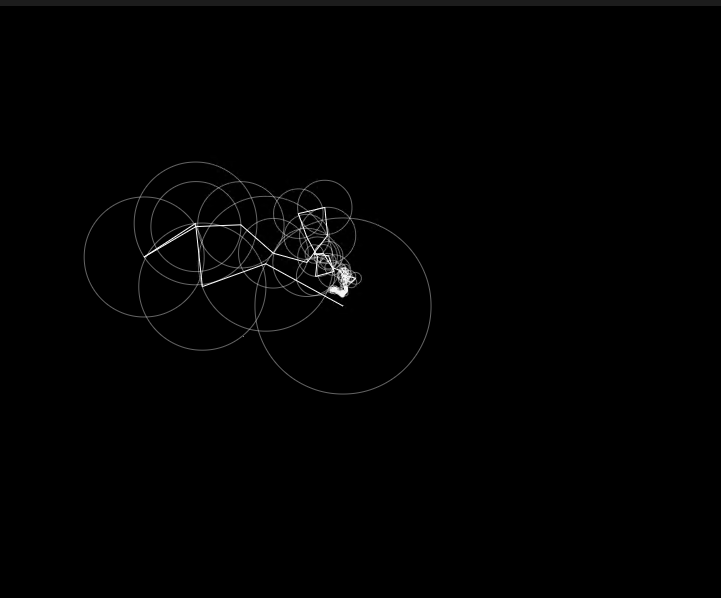

  
<font size=5>————面向小白的优雅画图指导</font>

<font size=3.5>**AUGUST 16, 2023** | UPDATED NOVEMBER 16 (MY BIRTHDAY!!!), 2023</font>

<br><br>
这篇文章是写给那些想迫切地学会用Fourier画图的人的，相信看完后读者一定能达成目标，就算没有，也不会让你白看一遍！
!!! warning "<font size=3>**写在前面**</size>"
     * 基本的fourier级数相关的东西要晓得，如果不知道，也要清楚它大概是干嘛的；
     * 一笔画闭合曲线的描点图是用Adobe Illustrater的钢笔工具完成的，其他软件理论上也可以，只要能够描点并将路径保存为svg文件即可；
     * svg文件需要进行处理才能得到一些坐标点，处理过程由python的svgpathtools库来完成；
     * 画图程序的代码是在p5js.org这个网页上跑的（<del>先看看能不能登上去</del>）。

<br><br>
### <font color=DodgerBlue font size=5>**理论**</font> 
fourier画图就是对一个满足Direclet条件的函数，都可以用一堆 $\sin$ 跟 $\cos$ 来近似它。什么，你不知道什么是Direclet条件？笨蛋，Direclet条件就是Direclet这个人提出的一个充分不必要条件啊！看下面：

 >   * 第一，绝对不意气用事
 >   * 第二，绝对不漏判任何一件坏事
 >   * 第三，绝对裁判的公正漂亮

不对，串台了...应该是这个：

>   * 一个周期内连续或第一类间断点数目有限
>    * 一个周期内极值点数目有限
>    * 一个周期内函数绝对可积

就拿方波函数
$f(t) = \left\{ {\begin{array}{*{20}{c}}
1&{|t| < 0.5\pi}\\
-1&{0.5\pi<|t|<\pi}
\end{array}} \right.$
来说，教材上明确表示其Fourier级数为$\frac{4}{\pi}  \sum\limits_{n = 1}^\infty  \frac{(-1)^{n-1} \cos (2n-1)t}{2n-1}$ ，至于怎么算的，教材上说的就去看教材好了，我们这里只说用编程来画图！！！
所以理论上任何周期函数都可以遵循这套流程，知道了它分解后的$\sin$与$\cos$的成分，接下来编程画图就是水到渠成了！（也没那么水到渠成）
我们这里要弄的是一个平面一笔画，就是说平面上的点都可以写成$z(t)=x(t)+iy(t)$的形式。

仔细一看，并没有比之前的情况走得多远：由于是个一笔画，所以$z(t)$具有周期性，所以$x(t)$与$x(t)$具有周期性，只需要分别对它们求对应的Fourier级数，分别画图，然后将结果综合起来即可。
!!! note "<font size=3>**注：**</size>"
    写成$z(t)=x(t)+iy(t)$是为了便于类比，但这里我们是要在程序中画图，所以是应当是离散的时间，故改成$z(n)=x(n)+iy(n)$，我们的Fourier级数也就成为了离散版本的[DFT](about.md)。

理论已经拿下，下面开始实践！
<br><br>

### <font color=DodgerBlue  font size=5>**实践**</font> 

> 建议跟俺的[B站视频]()https://www.bilibili.com/video/BV19N411u71A搭配食用

#### <font size=4>STEP1--描点</font>

没有点怎么画图？所以先找到自己想要绘制的图片，用钢笔工具进行描点，得到一条闭合路径。像这样：<br><br>
{: width="27%" height="27%"}  &nbsp;&nbsp;&nbsp;&nbsp;
{: width="30.7%" height="30.7%"}
<br>
!!! note "<font size=3>**注：**</size>"
    * 这里描绘路径上的点尽可能密集一些，最后得到的结果会更好；<br>
    * 本人**十分尊重**Newton先生，这里为了一笔画不断才显得有些滑稽，没有故意恶搞的意思。

#### <font size=4>STEP2--得出点坐标</font>
将这些点所围的路径选中，鼠标右击-导出所选项目-选择svg格式，然后用pycharm打开此svg文件，<del>不出意外的话</del>应该是这种风格的：<br>
```py title="NewtonSVG.svg"  hl_lines='6'
<svg xmlns="http://www.w3.org/2000/svg" viewBox="0 0 1620 1887.65">
    <defs><style>.cls-1{fill:#fff;}</style></defs>
    <title>资源 2</title>
    <g id="图层_2" data-name="图层 2"><g id="图层_1-2" data-name="图层 1">
        <path class="cls-1"
              d="M0,1887.65l42.26-82.17,58.7-115,70.43-115,79.83-77.48,89.21-77.48,101-70.43".../>
    </g></g></svg>
```
本来只有一行，为了显示方便我进行了调整。别看这么多东西，我们需要的只有标出来的那个`d`，它里面存有路径点坐标信息，不过用的是另一套表示方法，我们想要的是笛卡尔直角坐标的那种，怎么办呢？

python大法，启动！

```py title="trans_to_Descartes.py"  linenums='1'  hl_lines='3'
from svgpathtools import parse_path

d_string = "M0,1887.65l42.26-82.17,58.7-115,70.43-115,..."

path_data = parse_path(d_string)
coords = [(segment.start.real, segment.start.imag) for segment in path_data]

def transform_coordinates(coordinates):
    transformed_coordinates = [{'x': coord[0], 'y': coord[1]} for coord in coordinates]
    return transformed_coordinates

z = transform_coordinates(coords)
z_str = repr(z).replace("},", "},\n")
print(z_str)
```
把svg文件的那个`d`赋值给`d_string`后，就会在`coords`变量中得到我们所需要的笛卡尔坐标点，然后定义`transform_coordinates`函数，用于将坐标进一步调整为`p5.js`可用的样式，大概是这种：
```py
[{'x': 0.0, 'y': 1887.65},
 {'x': 42.26, 'y': 1805.48},
 {'x': 100.96, 'y': 1690.48},
 {'x': 171.39, 'y': 1575.48},
 {'x': 251.22, 'y': 1498.0},
        ... 
        ...  
 
 {'x': 0.0, 'y': 1887.6899}]
```
然后将其**复制**。
<br><br>
!!! claim "<font size=3>叠个甲"
     由于本人并不懂`javascript`，所以这一块代码框架用的是Daniel Shiffman写的，相关的信息在下面列出：
    ```javascript hl_lines="5" 
     Coding Challenge 130.1: Drawing with Fourier Transform and Epicycles
     Daniel Shiffman
     https://thecodingtrain.com/CodingChallenges/130.1-fourier-transform-drawing.html 
     https://youtu.be/MY4luNgGfms 
     https://editor.p5js.org/codingtrain/sketches/ldBlISrsQ 
    ```
    如果想知道Shiffman编程的经过，可以点开相应的视频观看。<del>不过我们这里只是借他的代码一用</del>，所以只消打开标亮的那个网址就好[doge]

#### <font size=4>STEP3--调整点在画布中的位置分布</font>

在使用Shiffman的代码画图之前，我们要先看看自己找的坐标点位置分布，是不是在画布可显示的范围之内。如果不能，就需要进行调整，所以我们新建一个独立的`test.js`文件，里面有
```javascript hl_lines="11 24" linenums="1" title="test.js"
function scaleCoordinates(drawing, b1, b2, k) {
  let scaledDrawing = [];
  for (let i = 0; i < drawing.length; i++) {
    let scaledX = (drawing[i].x+b1) * k;
    let scaledY = (drawing[i].y+b2) * k;
    scaledDrawing.push({'x': scaledX, 'y': scaledY});
    }
  return scaledDrawing;
}

let drawing_pre = [
 {'x': 0.0, 'y': 1887.65},
 {'x': 42.26, 'y': 1805.48},
 {'x': 100.96, 'y': 1690.48},
 {'x': 171.39, 'y': 1575.48},
 {'x': 251.22, 'y': 1498.0}, 
    ...
    ...
 {'x': 1608.26, 'y': 1875.95},
 {'x': 1258.43, 'y': 1887.69},
 {'x': 0.0, 'y': 1887.69}
];

let drawing = scaleCoordinates(drawing_pre, 0, 0, 1)

function setup() {
   createCanvas(800, 800);
}
function draw() {
    background(255);
    for (let i = 0; i < drawing.length; i++) {
    point(drawing[i].x, drawing[i].y, 3);
    stroke('purple');
    strokeWeight(10);
    }
}
```
这里`drawing_pre`是我们先前复制的坐标列表，`setup`函数创建了一块800像素的画布，`draw`用于绘制坐标点，我们运行程序后，得到这个
>前方高能，请务必在夜间模式下观看！

{: width="40%" height="40%"}

咦，我图呢？
这种情况下就是`scaleCoordinates`函数发挥作用的时候了，它可以将全体像素点同时进行平移、缩放，相应的数值对应于传入的4个参数中的后三个。<br>经过短暂的（<del>这真的很短暂</del>）调参后，我将上面程序高亮的那一行参数设为`scaleCoordinates(drawing_pre, -1200, -1350, 0.3)`后，伟大的Issac Newton头像就处在了画布中心区域。<br>

{: width="40%" height="40%"}
<br>
#### <font size=4>STEP4--画图</font>
Shifman的代码发挥作用的时候到了，将之前`test.js`的第25行之后的代码都注释掉，并全选后复制，然后用它覆盖掉Shiffman代码文件`ct.js`里面的所有内容，然后到`sketch.js`下先将变量`const skip`的值由8改成1，再运行。如果没显示，回到`ct.js`中修改参数即可。
<br><br>
> **Mr.Newton**：


>**Mr.Leibniz**

{: width="27%" height="27%"}  &nbsp;&nbsp;&nbsp;&nbsp;
{: width="44.2%" height="44.2%"}

>**Mr.Huygens**

{: width="27%" height="27%"}  &nbsp;&nbsp;&nbsp;&nbsp;
{: width="43.9%" height="43.9%"}

<br><br><br><br>

>----<font size=4 >**送给惠更斯先生:smile:**</font>